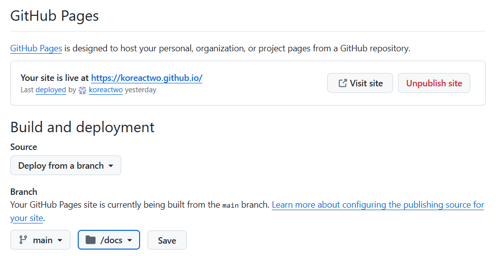

### setting
- 깃허브계정명.github.io 형태의 저장소를 만든다

```
ssh-keygen -t ed25519 -C "koreactwo.google.com" -f ~/.ssh/koreactwo_key
cat ~/.ssh/koreactwo_key.pub
```
- settigs에 SSH 퍼블릭키를 등록한다
- 저장소를 vscode와 연동시킨다 (git clone)

```
cat <<EOF >> ~/.ssh/config

# 특정 프로젝트 전용 설정
Host koreactwo # 별칭
  HostName github.com # 실제 주소
  User git
  IdentityFile ~/.ssh/koreactwo_key # 별칭에 적용할 키
  IdentitiesOnly yes  # 이 줄이 핵심입니다. 에이전트의 다른 키를 무시합니다.
EOF
```
- ssh config 설정 : 별칭을 넣어서 저장소 별로 키를 지정한다

```
git remote set-url origin git@koreactwo:koreactwo/koreactwo.github.io.git

git config --list --local

# 주소를 별칭으로해야 지정된 키를 사용한다
ssh -T git@koreactwo
```

### react 설정
- 
```
docker run -it --rm -v $(pwd):/app -w /app -p 5173:5173 node:lts bash
```
- 컨테이너 attach 
- 이후
```
npm create vite@latest .
npm create vite@latest . -- --template react-ts
npm install
npm run dev

```
- 만약 페이지가 안열리면 package.json 파일에서 스크립트 부분을 아래처럼 수정한다 . 
```
"scripts": {
    "dev": "vite --host 0.0.0.0", 
}
```


### 배포 및 Pages 연동
- vite.config.ts 에서 build 객체 추가 , 아웃풋을 docs로 지정
```
import { defineConfig } from 'vite'
import react from '@vitejs/plugin-react'

// https://vite.dev/config/
export default defineConfig({
  plugins: [react()],
  build:{
    // 빌드 결과물이 생성될 디렉터리 지정
    outDir: 'docs',
    // 기존 docs 디렉터리가 있다면 삭제 후 재생성 (기본값 true)
    emptyOutDir: true,
  },
})
```
- npm run build
- 
- 깃허브 Pages Root 변경 / -> /docs 그리고 save 버튼 클릭 